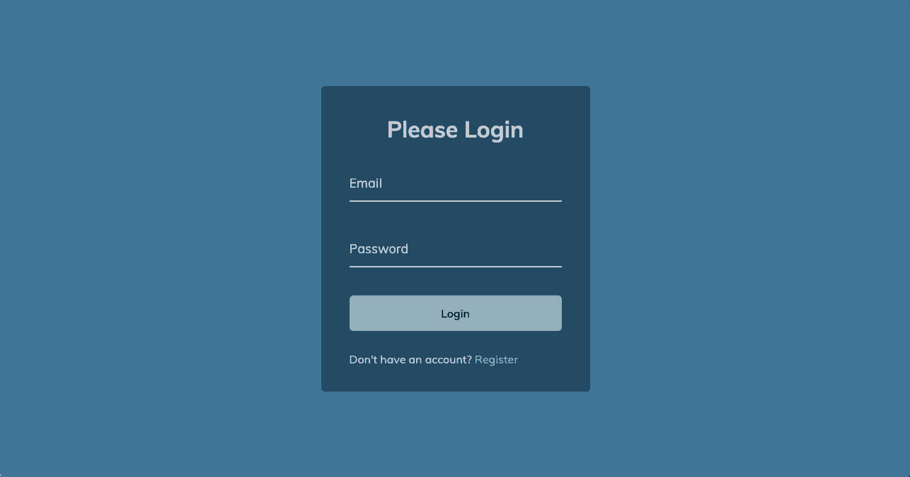

## Project Title

Form Input Wave

## Purpose

As a new developer, I want to do a daily coding project tutorial to learn new features and deepen my understanding of Web Development.

## Description

A login that has a wave effect on the labels of each input. When the input is clicked on the label will wave up.

## Demo

https://curtiskil.github.io/form-input-wave/

## Contributors

Brad Traversy. Florin Pop.
